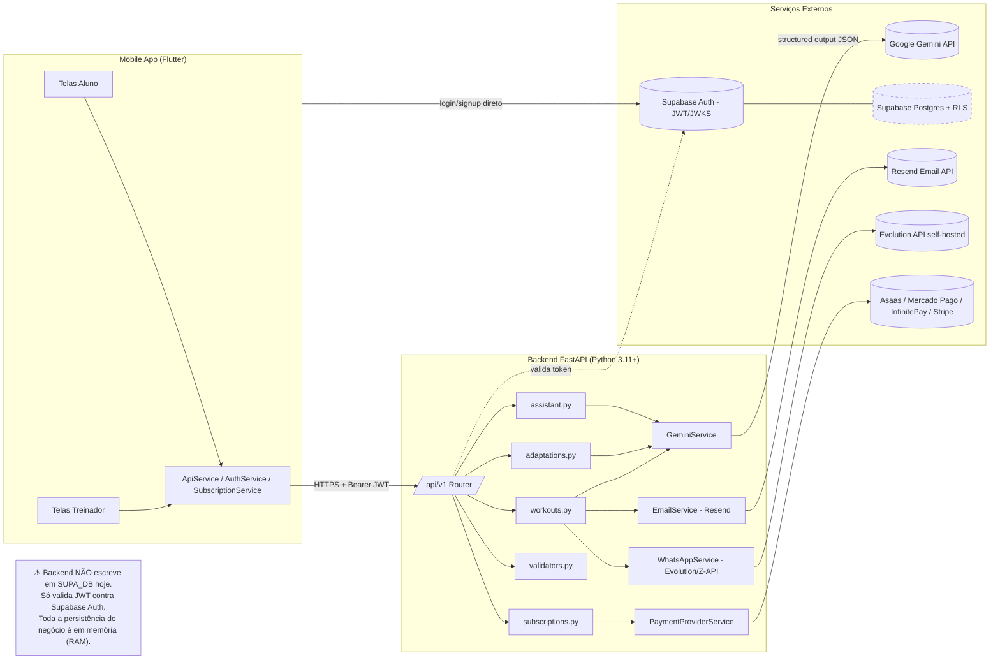
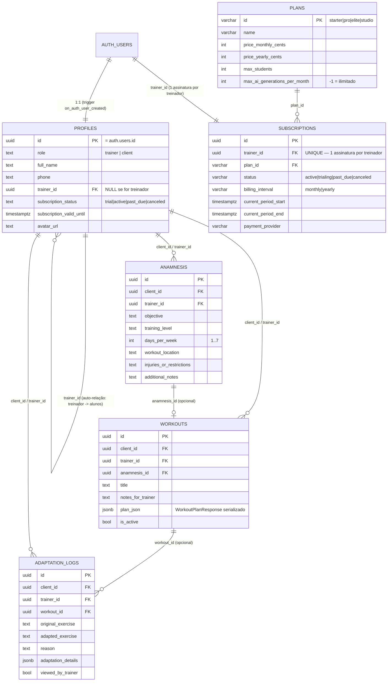
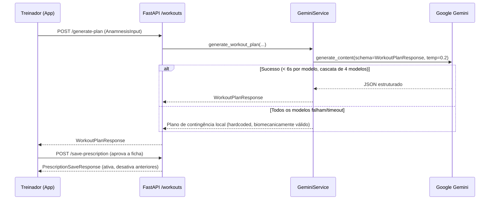
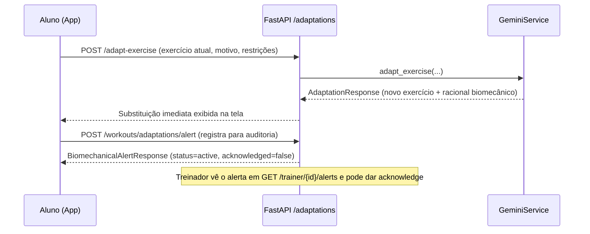
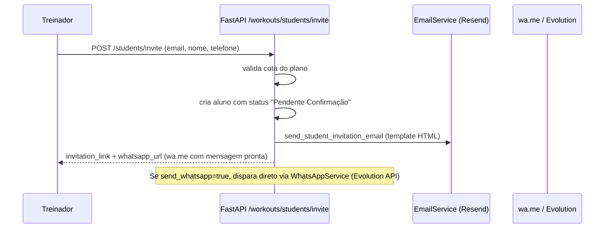
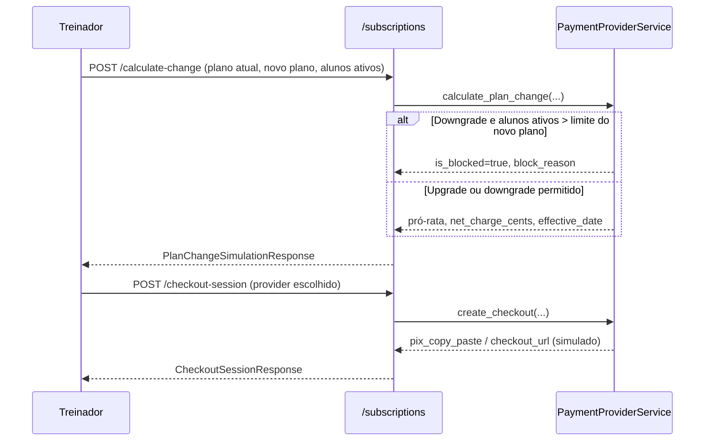

# Auditoria Completa do Sistema — B2B Personal IA ("Mr. Coach")

> **Documento vivo de referência técnica e de negócio.** Escrito para ser lido tanto por humanos (product owners, devs, novos integrantes) quanto por agentes de IA que precisem entender o projeto rapidamente para gerar código, revisar PRs ou planejar features.
>
> - **Última atualização:** 2026-09-30
> - **Escopo analisado:** `backend/` (FastAPI), `mobile/` (Flutter), `supabase/` (Postgres/RLS), `landing/`, arquivos de deploy (`render.yaml`, `railway.toml`, `docker-compose-evolution.yml`, `Makefile`).
> - **Método:** leitura direta do código-fonte (endpoints, schemas, services, prompts, migrations, mobile services) — não há suposições sobre comportamento não observado no código.

---

## 0. Resumo Executivo (TL;DR)

O **B2B Personal IA** (marca comercial **"Mr. Coach"**) é uma plataforma **SaaS B2B mobile** para **Personal Trainers e consultorias fitness**, que usa **IA generativa (Google Gemini)** para:

1. Gerar periodizações de treino completas (splits A/B/C...) a partir de uma anamnese clínica.
2. Adaptar exercícios **em tempo real** dentro da academia quando um aparelho está ocupado ou o aluno sente dor (o "Botão de Emergência").

O treinador gerencia seus alunos, aprova/edita as fichas geradas, recebe alertas de dor/adaptação, e paga uma assinatura mensal/anual em um de 4 planos (Starter/Pro/Elite/Studio) que limitam quantidade de alunos e gerações de IA.

**Estado real de maturidade:** o backend é funcional e bem estruturado no nível de API (FastAPI + Pydantic v2 + Google GenAI SDK), mas a **persistência de dados de negócio (alunos, prescrições, alertas, assinaturas) ainda é 100% em memória (dicionários Python)** — apesar de já existir um schema Postgres completo e com RLS no Supabase para essas mesmas entidades. Isso é o ponto de atenção mais crítico do projeto (ver seção 8).

---

## 1. Proposta de Valor / Funcionalidades de Negócio

### 1.1 Para o Treinador (Personal Trainer / Consultoria)
- Cadastro e gestão de alunos (criar, editar, listar, arquivar, excluir, convidar por e-mail/WhatsApp).
- Anamnese clínica estruturada → geração de periodização completa via IA (Gemini) respeitando restrições articulares.
- Edição e aprovação da ficha antes de liberar para o aluno ("save-prescription").
- Painel de alertas biomecânicos: quando o aluno troca um exercício no salão, o treinador vê e pode "reconhecer" (`acknowledge`) o alerta.
- Assistente de IA conversacional B2B ("Mr. Coach AI") para dúvidas de biomecânica, fisiologia, técnicas avançadas de treino e **estratégia comercial/retenção de alunos**.
- Gestão de assinatura SaaS: ver planos, assinar, simular upgrade/downgrade, checkout via Pix/cartão.
- Validação de documento profissional (CREF, CBMF ou CPF) no cadastro.

### 1.2 Para o Aluno (Cliente do treinador)
- Visualização da ficha de treino ativa (séries, reps, descanso, notas de execução).
- **Botão de Emergência**: ao tocar em "Aparelho Ocupado" ou "Dor/Desconforto", a IA sugere instantaneamente uma variação biomecanicamente equivalente (mesmo vetor motor), sem precisar do treinador presente.
- Toda substituição é registrada como alerta/log para auditoria do treinador.
- Onboarding via convite (link + WhatsApp) preenchendo anamnese própria.
- Acesso ao mesmo assistente de IA (modo aluno).

### 1.3 Modelo de Negócio (SaaS)
4 planos comerciais (definidos em código e espelhados na migration `20260928_subscriptions.sql`):

| Plano | Preço mensal | Preço anual (equiv./mês) | Alunos máx. | Gerações IA/mês | Destaque |
|---|---|---|---|---|---|
| **Starter Trial** | Grátis | Grátis | 3 | 10 | Trial de degustação |
| **Personal Pro** | R$ 89,00 | R$ 852,00 (R$ 71,00) | 30 | Ilimitado | Mais popular |
| **Elite Coach** | R$ 149,00 | R$ 1.428,00 (R$ 119,00) | 60 | Ilimitado | Automação WhatsApp |
| **Studio Scale** | R$ 199,00 | R$ 1.908,00 (R$ 159,00) | 100 | Ilimitado | Multi-personal / White-label parcial |

Todos os preços/limites existem **duplicados** em três lugares: `backend/app/api/v1/endpoints/subscriptions.py` (`SAAS_PLANS`), `backend/app/services/payment_service.py` (`PLANS_INFO`, usado no cálculo de troca de plano) e `supabase/migrations/20260928_subscriptions.sql` (tabela `plans`). **Risco de divergência** — ver seção 8.

---

## 2. Arquitetura do Sistema

```
B2B-personal-ia/
├── backend/     API Python (FastAPI + Pydantic v2 + Google GenAI SDK)
├── mobile/      App Flutter (Android/iOS/Web/Desktop) — cliente único para Trainer e Client
├── supabase/    Migrações SQL, RLS Policies, Triggers, templates de e-mail
├── landing/     Landing page estática (HTML)
├── docker-compose-evolution.yml   Evolution API (WhatsApp self-hosted) para automação
├── render.yaml / railway.toml     IaC de deploy do backend (Render.com e Railway)
└── Makefile     Atalhos de desenvolvimento
```

### 2.1 Diagrama de Arquitetura



### 2.2 Stack Tecnológica

| Camada | Tecnologia | Versão observada |
|---|---|---|
| Mobile | Flutter / Dart | SDK `>=3.7.0 <4.0.0` |
| Mobile — Auth/DB client | `supabase_flutter` | `^2.17.2` |
| Mobile — HTTP | `http` | `^1.6.0` |
| Mobile — Fontes | `google_fonts` | `^8.2.1` |
| Mobile — Persistência local | `shared_preferences` | `^2.5.5` |
| Backend | Python | `>=3.11` (runtime.txt) |
| Backend — Framework | FastAPI | `>=0.115.0` |
| Backend — Servidor ASGI | Uvicorn | `>=0.30.0` |
| Backend — Validação | Pydantic | `>=2.8.0` (v2, `pydantic-settings>=2.4.0`) |
| Backend — IA | `google-genai` | `>=0.1.1` |
| Backend — Auth | `pyjwt[crypto]` | `>=2.9.0` |
| Backend — HTTP client | `httpx` | `>=0.27.0` |
| Testes | `pytest`, `pytest-asyncio` | `>=8.3.0` / `>=0.24.0` |
| Banco de Dados | Supabase (PostgreSQL) | — |
| Auth | Supabase Auth (JWT ES256/RS256 via JWKS, fallback HS256) | — |
| E-mail transacional | Resend API (com fallback mock) | — |
| WhatsApp | Evolution API v2 (self-hosted via Docker) ou mock | — |
| Pagamentos | Asaas, Mercado Pago, InfinitePay, Stripe (todos **mockados/simulados** no código atual) | — |
| Deploy backend | Render.com (`render.yaml`) e Railway (`railway.toml` + Dockerfile) | — |
| IA — Modelos configurados | `gemini-2.5-flash`, `gemini-2.5-flash-lite`, `gemini-1.5-flash`, `gemini-1.5-flash-8b` (fallback em cascata); `config.py` referencia também `gemini-3.6-flash`/`gemini-3.8` (README) | ⚠️ inconsistência — ver seção 8 |

---

## 3. Modelagem de Dados (Supabase / PostgreSQL)

### 3.1 Diagrama Entidade-Relacionamento



### 3.2 Triggers e Funções de Banco (regras de negócio no nível de dados)

| Objeto | Arquivo | Função |
|---|---|---|
| `handle_new_user()` + trigger `on_auth_user_created` | `20260925_init_schema.sql` | Cria automaticamente uma linha em `profiles` sempre que um usuário é criado no Supabase Auth, lendo `raw_user_meta_data` (full_name, role, phone, trainer_id). |
| `handle_updated_at()` | `20260925_init_schema.sql` | Atualiza `updated_at` automaticamente em `profiles`, `anamnesis`, `workouts`. |
| `check_trainer_student_quota(trainer_id)` | `20260928_subscriptions.sql` | Função auxiliar que calcula se o treinador ainda tem vaga (baseada no plano ativo/trial, default 3). |
| `enforce_trainer_student_quota()` + trigger `trg_enforce_trainer_student_quota` | `20260928_subscriptions.sql` | **Bloqueia a nível de banco** (via `RAISE EXCEPTION`, `ERRCODE 23514`) a criação/reativação de aluno além do limite do plano contratado. Isso é uma segunda camada de proteção, redundante com a validação em Python do backend. |

### 3.3 Row Level Security (RLS)

Todas as tabelas (`profiles`, `anamnesis`, `workouts`, `adaptation_logs`, `plans`, `subscriptions`) têm RLS **habilitado**. Regras principais:
- Usuário só vê/edita o próprio `profiles` (`auth.uid() = id`); treinador enxerga perfis de alunos vinculados (`trainer_id = auth.uid()`).
- Treinador tem CRUD completo (`FOR ALL`) sobre `anamnesis` e `workouts` dos seus alunos; aluno só tem `SELECT` dos seus próprios registros.
- Aluno pode **inserir** (`INSERT`) seus próprios `adaptation_logs` (o botão de emergência), mas não editar; treinador pode ler e atualizar (marcar como visto).
- `plans` é público para leitura (`USING (true)`); `subscriptions` só é visível/editável pelo próprio treinador (`auth.uid() = trainer_id`).

> ⚠️ **Nota crítica:** este RLS é robusto e correto — mas hoje **não está sendo usado pelo backend FastAPI**, pois o backend não grava nem lê dessas tabelas (ver seção 8.1). O RLS protegeria, na prática, apenas escritas feitas *diretamente* pelo app mobile via `supabase_flutter` (o SDK é inicializado em `main.dart` e o `AuthService` usa `Supabase.instance.client.auth` para login/signup) — mas as telas de treino, alunos e assinatura observadas usam o `ApiService` (HTTP para o FastAPI), não o client Postgrest do Supabase diretamente.

---

## 4. Especificação da API (Backend FastAPI)

Base path: `/api/v1`. Documentação interativa automática em `/docs` (Swagger) e `/redoc`. Health check em `/health`. Rota de compatibilidade legada `POST /api/generate` (alias de `assistant/chat`).

### 4.1 `workouts` (prefixo `/workouts`)

| Método | Rota | Descrição | Regras/Validações |
|---|---|---|---|
| POST | `/generate-plan` | Gera periodização via IA a partir da anamnese (`AnamnesisInput`) | Usa `GeminiService`; erro → 500 com detalhe |
| POST | `/save-prescription` | Salva/ativa uma ficha para um aluno | Desativa prescrições anteriores do mesmo `client_id`; atualiza status do aluno para "Ativo" |
| GET | `/client/{client_id}/active` | Retorna ficha ativa do aluno | 404 se não houver prescrição ativa |
| POST | `/students` | Cadastra aluno | Valida formato de e-mail, duplicidade, **e cota de alunos do plano** (403 se atingido) |
| GET | `/students` | Lista alunos do treinador logado | Filtra por `trainer_id` (com fallback para `current-trainer`/dev user) |
| PUT | `/students/{student_id}` | Edita dados do aluno | Revalida cota se reativar aluno arquivado/inativo |
| PATCH | `/students/{student_id}/status` | Ativa/Arquiva aluno | Mesma validação de cota na reativação |
| DELETE | `/students/{student_id}` | Exclui aluno | — |
| POST | `/adaptations/alert` | Registra alerta biomecânico (dor/troca) | — |
| GET | `/trainer/{trainer_id}/alerts` | Lista alertas do treinador | — |
| PATCH | `/alerts/{alert_id}/acknowledge` | Marca alerta como ciente | 404 se não existir |
| POST | `/students/invite` | Convida aluno (e-mail + WhatsApp) | Valida cota; gera link de onboarding; dispara e-mail via Resend e/ou URL `wa.me` |

### 4.2 `adaptations` (prefixo `/adaptations`)

| Método | Rota | Descrição |
|---|---|---|
| POST | `/adapt-exercise` | **Botão de Emergência**: substitui exercício em tempo real via IA (mesmo vetor motor), com fallback de contingência se a IA falhar |

### 4.3 `subscriptions` (prefixo `/subscriptions`)

| Método | Rota | Descrição |
|---|---|---|
| GET | `/plans` | Lista os 4 planos SaaS estáticos |
| GET | `/my-subscription` | Retorna assinatura ativa do treinador (cria uma "Personal Pro" default se não existir) |
| POST | `/activate-plan` | Ativa/troca plano imediatamente |
| POST | `/calculate-change` | Simula upgrade/downgrade (pró-rata, bloqueio por excesso de alunos) |
| POST | `/checkout-session` | Cria sessão de checkout (Asaas/Mercado Pago/InfinitePay/Stripe) — **todas simuladas** |
| POST | `/webhook/asaas`, `/webhook/mercadopago`, `/webhook/infinitepay`, `/webhook/stripe`, `/webhook` | Webhooks de confirmação de pagamento (processam payload e retornam status, mas **não persistem** nada) |

### 4.4 `assistant` (prefixo `/assistant`)

| Método | Rota | Descrição |
|---|---|---|
| POST | `/chat` | Conversa com o "Mr. Coach AI" (persona B2B: biomecânica + fisiologia + negócios) |
| POST | `/generate` | Alias de compatibilidade |

### 4.5 `validators` (prefixo `/validators`)

| Método | Rota | Descrição |
|---|---|---|
| POST | `/verify-document` | Valida **CPF** (algoritmo Módulo 11 da Receita Federal), **CREF** (regex + UF válida) ou **CBMF** (regex alfanumérico) |

---

## 5. Fluxos de Negócio Principais

### 5.1 Geração de Ficha de Treino via IA



### 5.2 Botão de Emergência (Adaptação em tempo real no salão)



### 5.3 Onboarding de Aluno via Convite



### 5.4 Assinatura / Mudança de Plano



---

## 6. Regras de Negócio (consolidado)

1. **Cota de alunos por plano** — um treinador não pode ter mais alunos **ativos** (status ≠ "Arquivado"/"Inativo") do que `max_students` do seu plano vigente. Validado em **3 camadas independentes**: (a) Python no endpoint (`_count_trainer_occupied_slots` / `_get_trainer_max_students`), (b) trigger Postgres `enforce_trainer_student_quota` (não usado hoje, pois backend não escreve no Postgres), (c) resposta simulada em `PaymentProviderService.calculate_plan_change`.
2. **Downgrade bloqueado** se o número de alunos ativos exceder o limite do novo plano — o usuário precisa arquivar alunos antes.
3. **Upgrade é imediato**; **downgrade só entra em vigor no fim do ciclo de faturamento atual**.
4. **Geração de IA ilimitada** em Pro/Elite/Studio; **10/mês no Starter Trial** (limite definido no schema de planos, mas **não há enforcement/contador observado no código** dos endpoints de workout — ver seção 8).
5. **Prescrição ativa é única por aluno** — ao salvar uma nova, todas as anteriores daquele `client_id` são marcadas `is_active=False`.
6. **Segurança articular biomecânica mandatória no prompt de IA**: o `SYSTEM_INSTRUCTION_PLAN_GENERATOR` proíbe explicitamente desenvolvimento por trás da nuca, puxada atrás do pescoço, elevação lateral com rotação interna acima de 90°, agachamento livre pesado/terra com lesão lombar aguda, entre outras regras de proteção de ombro/lombar/joelho.
7. **Fallback de alta disponibilidade da IA**: se todos os modelos Gemini falharem/timeout (6s por modelo, cascata de até 4 modelos), o sistema retorna um **plano de contingência pré-programado** (Full Body, PPL, etc.) — o usuário nunca vê um erro bruto de IA.
8. **Validação de documento profissional**: CPF usa o algoritmo oficial Módulo 11 da Receita Federal; CREF valida formato `NNNNNN-G/UF` com UF brasileira válida; CBMF aceita alfanumérico com prefixo opcional.
9. **Autenticação**: JWT do Supabase Auth é validado via JWKS (ES256/RS256) com fallback para `SUPABASE_JWT_SECRET` (HS256) e, em último caso (ambiente `development`), um usuário mock (`dev-user-...`) é injetado automaticamente se não houver header de autorização.
10. **Convite de aluno** sempre cria o registro com status **"Pendente Confirmação"** e consome uma vaga da cota do plano imediatamente (mesmo antes da confirmação do aluno).
11. **Preços e limites de planos são fixos no código** (não há tabela de preços dinâmica consumida em runtime pelo backend — a tabela Postgres `plans` existe mas não é lida pelos endpoints).

---

## 7. Segurança

| Item | Estado atual | Observação |
|---|---|---|
| Autenticação | JWT Supabase (JWKS + fallback HS256) | Implementação correta e em camadas |
| Autorização (RLS) | Habilitada em todas as tabelas Postgres | **Não exercida** pelo backend hoje (ver 8.1) |
| CORS | `CORS_ORIGINS` configurável, default `"*"` no `render.yaml` | ⚠️ Em produção, `allow_origins=["*"]` combinado com `allow_credentials=True` é uma combinação desaconselhada pelo próprio spec CORS/OWASP (navegadores modernos já bloqueiam credentials com wildcard, mas é boa prática restringir explicitamente aos domínios do app/landing) |
| Modo dev sem token | Bypass de autenticação quando `ENVIRONMENT=development` e não há header | Correto para dev, mas **checar sempre** que `ENVIRONMENT` nunca seja setado como `development` em produção |
| Segredos | `.env` git-ignored; `render.yaml` usa `sync: false` para secrets (`GEMINI_API_KEY`, `SUPABASE_SECRET_KEY`, `SUPABASE_JWT_SECRET`) | Correto — segredos não versionados |
| Chave pública Supabase | `SUPABASE_PUBLISHABLE_KEY` hardcoded como valor (não secreta) em `config.py`, `render.yaml` e `app_config.dart` | Correto — é a "anon key", projetada para ser pública |
| WhatsApp Evolution API key | `mr_coach_secret_api_key_2026` hardcoded em `docker-compose-evolution.yml` e `whatsapp_service.py` (default) | ⚠️ Trocar por variável de ambiente antes de qualquer deploy real com Evolution API exposta publicamente |
| Validação de entrada | Pydantic v2 em todos os schemas (`Field`, `ge/le`, `min_length`) | Boa cobertura de tipos/ranges |
| Injeção de dados sensíveis nos prompts de IA | Dados de anamnese (histórico de lesões) trafegam em texto puro para a API do Google Gemini | Aceitável dado o propósito do produto, mas deve constar em política de privacidade/LGPD (dado de saúde é sensível) |

---

## 8. Pontos de Atenção (Riscos Técnicos)

### 8.1 🔴 Persistência em memória (o achado mais crítico)
Todos os "bancos de dados" do backend hoje são **dicionários Python em módulo** (`_STUDENTS_STORE`, `_ALERTS_STORE`, `_PRESCRIPTIONS_STORE` em [workouts.py](backend/app/api/v1/endpoints/workouts.py), `ACTIVE_TRAINER_SUBSCRIPTIONS` em [subscriptions.py](backend/app/api/v1/endpoints/subscriptions.py)). Consequências:
- **Perda total de dados** a cada deploy/restart/crash do processo (Render free tier "dorme" e reinicia o dyno com frequência).
- **Inconsistência entre workers**: `railway.toml` sobe `uvicorn --workers 2` — cada worker tem sua própria cópia da memória, então um aluno criado no worker A pode "não existir" para uma requisição atendida pelo worker B.
- O schema Postgres completo com RLS, triggers de cota e templates de e-mail **já existe e está pronto**, mas **não é consumido** pelo backend Python — hoje ele só usa o Supabase para validar o JWT.
- Isso também significa que a trigger de banco `enforce_trainer_student_quota` (redundância de segurança) nunca é exercida na prática.

### 8.2 🟠 Múltiplas fontes de verdade para os planos SaaS
Preços/limites dos planos existem em 3 lugares que podem divergir silenciosamente: `subscriptions.py::SAAS_PLANS`, `payment_service.py::PLANS_INFO` (dentro de `calculate_plan_change`) e a migration `20260928_subscriptions.sql`. Uma alteração de preço exige lembrar de editar os três.

### 8.3 🟠 Gateways de pagamento 100% simulados
`PaymentProviderService.create_checkout` e `process_webhook` geram URLs/QR-codes falsos (`pix_code` com UUID aleatório, sem chave Pix real; `checkout_url` para `sandbox.asaas.com/c/{session_id}` que não existe de fato) e os webhooks **não persistem** nenhuma mudança de status. Não há integração real com Asaas/Mercado Pago/InfinitePay/Stripe (nenhuma chamada HTTP de saída para essas APIs foi encontrada). Isso é aceitável como *stub* de demonstração, mas está a uma distância grande de produção real de cobrança.

### 8.4 🟠 Duplicação de código do serviço Gemini B2B
Existem **dois arquivos quase idênticos**: [backend/gemini_b2b_service.py](backend/gemini_b2b_service.py) (raiz do backend, standalone, usa `requests` síncrono) e [backend/app/services/gemini_b2b_service.py](backend/app/services/gemini_b2b_service.py) (mesma lógica). Nenhum dos dois parece ser importado pelo `app/main.py` ou pelos endpoints atuais (que usam `app/services/gemini_service.py`, baseado no SDK oficial `google-genai` assíncrono). Parecem ser **código legado/exploratório** apontando para um gateway Cloud Run externo (`AIS_GATEWAY_URL`) diferente do fluxo principal.

### 8.5 🟡 Inconsistência de nomes de modelo Gemini
`config.py` e `render.yaml` configuram `DEFAULT_FAST_MODEL`/`DEFAULT_DEEP_MODEL = "gemini-3.6-flash"`, o README menciona "Gemini 3.8", mas o `GeminiService` (código que realmente roda) usa uma lista fixa `["gemini-2.5-flash", "gemini-2.5-flash-lite", "gemini-1.5-flash", "gemini-1.5-flash-8b"]` e **ignora** as variáveis `DEFAULT_FAST_MODEL`/`DEFAULT_DEEP_MODEL` do `settings`. Ou seja, essas duas env vars hoje não têm efeito nenhum no comportamento real.

### 8.6 🟡 Fallback de `trainer_id` muito permissivo
Vários endpoints tratam os literais `"current-trainer"` e `"dev-user-0000-0000-000000000001"` como coringas que dão acesso a **qualquer** registro independentemente do `trainer_id` real (ex.: `list_students`, `list_trainer_alerts`, `_count_trainer_occupied_slots`). Isso é conveniente para demo/dev, mas se `ENVIRONMENT` for mal configurado em produção, pode causar **vazamento de dados entre treinadores** (qualquer usuário cujo JWT decodificado tenha `sub == "current-trainer"` veria dados de outro).

### 8.7 🟡 Falta de enforcement do limite de gerações de IA por mês
O plano Starter anuncia "10 gerações de IA/mês", mas não há nenhum contador (`ai_generations_used`) sendo incrementado a cada chamada real a `/workouts/generate-plan` ou `/adaptations/adapt-exercise` — o campo `ai_generations_used` em `MySubscriptionResponse` é hoje um valor fixo hardcoded (`12` ou `3`), não calculado a partir de uso real.

### 8.8 🟡 CORS aberto (`*`) em produção
Ver seção 7 — recomenda-se restringir a domínios conhecidos (`shaipados.com`, domínio do app mobile/landing) antes de ir a público.

### 8.9 🟢 Testes existentes cobrem principalmente schemas e regras estáticas
`backend/tests/` tem `test_config.py`, `test_schemas.py`, `test_subscriptions.py`, `test_validators.py`, `test_workouts.py` — boa cobertura de validação de planos e do `PaymentProviderService`, mas **não há testes de integração** dos endpoints reais com `TestClient`/mocks de `GeminiService` para os fluxos de `/generate-plan` e `/adapt-exercise` (o serviço de IA real não é mockado nos testes observados).

---

## 9. Pontos de Melhoria e Sugestões

### 9.1 Curto prazo (alto impacto, esforço moderado)
1. **Persistir de verdade no Supabase Postgres**: substituir os dicionários em memória por um client Postgrest/`asyncpg`/`supabase-py` no backend, reaproveitando o schema e o RLS já prontos. Isso resolve simultaneamente 8.1, 8.6 (RLS passa a ser a fonte real de isolamento entre treinadores) e permite múltiplos workers/instâncias sem inconsistência.
2. **Unificar a fonte de verdade dos planos SaaS**: criar um único módulo (`app/core/plans.py`) ou ler direto da tabela `plans` do Supabase, eliminando a duplicação entre `subscriptions.py` e `payment_service.py`.
3. **Remover ou isolar claramente os arquivos `gemini_b2b_service.py` duplicados** — decidir se são legado (remover) ou uma integração alternativa via gateway Cloud Run (documentar e mover para `scripts/` ou `legacy/`).
4. **Corrigir a leitura de `DEFAULT_FAST_MODEL`/`DEFAULT_DEEP_MODEL`** no `GeminiService` para respeitar o que está em `settings`, ou remover essas variáveis não utilizadas do `config.py`/`render.yaml` para não confundir.
5. **Implementar contagem real de gerações de IA por treinador/mês** para o plano Starter (hoje o limite é só cosmético).
6. **Restringir CORS** para os domínios reais de produção.

### 9.2 Médio prazo (evolução de produto)
7. **Integração real de pagamento** com pelo menos um gateway (Asaas é o mais indicado pelo footprint de Pix recorrente no Brasil), incluindo verificação de assinatura do webhook (hoje qualquer POST em `/webhook/*` é aceito sem validar assinatura/segredo do provedor).
8. **Idempotência nos webhooks de pagamento** (usar `event_id` para não processar o mesmo evento duas vezes).
9. **Auditoria/observabilidade**: adicionar logging estruturado (ex.: `structlog`) e métricas (latência do Gemini, taxa de fallback para contingência) — hoje só há `logger.warning`/`logger.info` esparsos.
10. **Versionamento de prompts de IA**: os `SYSTEM_INSTRUCTION_*` em `app/prompts/` são ótimos, mas seria valioso versioná-los (ex.: `v1`, `v2`) e registrar qual versão gerou cada `WorkoutPlanResponse` salvo, para rastreabilidade quando o prompt evoluir.
11. **Rate limiting** nos endpoints de IA (`/generate-plan`, `/adapt-exercise`, `/assistant/chat`) para conter abuso e custo de API do Gemini.

### 9.3 Sugestões de novas funcionalidades (roadmap)
12. **Histórico de cargas/progressão do aluno** (peso levantado, RPE relatado por sessão) — hoje o schema `Exercise` não tem campo para registrar performance real, só a prescrição.
13. **Dashboard de retenção/churn para o treinador** (o assistente de IA já dá *scripts* de retenção, mas não há dados agregados de assiduidade real no schema atual — os campos `last_session`/`active_split` do `StudentResponse` são strings livres, não dados estruturados de check-in).
14. **Notificações push** (hoje a única "notificação" é WhatsApp/e-mail transacional; não há Firebase Cloud Messaging ou equivalente).
15. **Multi-personal por conta** (mencionado como feature do plano Studio Scale na tagline, mas não há modelagem de "equipe"/"múltiplos treinadores por assessoria" no schema `profiles` — hoje é 1 `trainer_id` fixo por aluno).
16. **White-label parcial** (mencionado no plano Studio, sem implementação observada — provavelmente customização de cor/logo no app).
17. **Exportação da ficha em PDF** para impressão/uso offline no salão.
18. **Modo offline no app** para o aluno consultar a ficha sem internet (dado que o ambiente é uma academia, onde o Wi-Fi pode ser instável).

---

## 10. Estrutura de Pastas — Referência Rápida

```
backend/app/
├── main.py                    # bootstrap FastAPI, CORS, rota de compat /api/generate, /health
├── api/
│   ├── deps.py                 # DI: get_current_user, get_gemini_service
│   └── v1/
│       ├── router.py            # agrega todos os sub-routers
│       └── endpoints/
│           ├── workouts.py       # alunos, prescrições, alertas, convites (maior arquivo)
│           ├── adaptations.py    # botão de emergência
│           ├── subscriptions.py  # planos, assinatura, checkout, webhooks
│           ├── assistant.py      # chat IA B2B
│           └── validators.py     # CPF/CREF/CBMF
├── core/
│   ├── config.py               # Settings (pydantic-settings), lê .env
│   └── security.py             # decode_supabase_jwt, get_current_user_payload
├── prompts/
│   ├── plan_generator.py       # SYSTEM_INSTRUCTION_PLAN_GENERATOR + build_plan_prompt
│   └── exercise_adapter.py     # SYSTEM_INSTRUCTION_EXERCISE_ADAPTER + build_adaptation_prompt
├── schemas/                    # Pydantic models (anamnesis, workout, adaptation, subscription, assistant)
└── services/
    ├── gemini_service.py        # cliente Gemini com fallback em cascata + contingência offline
    ├── gemini_b2b_service.py    # ⚠️ duplicado/legado, ver 8.4
    ├── payment_service.py       # abstração multi-gateway (simulada)
    ├── email_service.py         # Resend + fallback mock
    └── whatsapp_service.py      # Evolution API + fallback mock

mobile/lib/
├── main.dart                   # bootstrap Supabase, MaterialApp, MainShellScreen (nav trainer/client)
├── core/{config,theme,widgets,utils}/
├── models/                     # WorkoutPlan, Exercise/Split, Adaptation, Subscription
├── services/                   # ApiService (HTTP p/ backend), AuthService (Supabase Auth direto), 
│                                 GeminiService (mobile), SubscriptionService, WorkoutService
└── features/
    ├── auth/                   # login_screen, register_screen
    ├── trainer/                # anamnesis_screen, trainer_students_screen, trainer_plan_selection_screen
    ├── client/                 # active_workout_screen, welcome_onboarding_screen
    ├── assistant/               # b2b_assistant_screen
    └── subscription/            # subscription_screen

supabase/
├── migrations/20260925_init_schema.sql     # profiles, anamnesis, workouts, adaptation_logs + RLS
├── migrations/20260928_subscriptions.sql   # plans, subscriptions + trigger de cota
├── seed.sql                                 # dados de exemplo (comentado)
└── templates/confirm_signup.html            # template de e-mail de confirmação/convite
```

---

## 11. Resumo Estruturado para Consumo por IA

```yaml
projeto: "B2B Personal IA (Mr. Coach)"
tipo: "SaaS B2B mobile para personal trainers, com prescrição e adaptação de treino via IA"
dominio_negocio: "fitness / biomecânica / gestão de consultoria esportiva"
usuarios:
  - role: trainer
    permissoes: [criar_aluno, editar_aluno, arquivar_aluno, gerar_ficha_ia, aprovar_ficha,
                 ver_alertas_biomecanicos, gerenciar_assinatura, usar_assistente_ia]
  - role: client
    permissoes: [ver_ficha_ativa, solicitar_adaptacao_exercicio, usar_assistente_ia]
stack:
  frontend: "Flutter (Dart >=3.7 <4.0), supabase_flutter 2.17.2"
  backend: "FastAPI (Python 3.11+), Pydantic v2, google-genai SDK"
  banco: "Supabase Postgres com RLS (schema pronto, MAS não consumido pelo backend hoje)"
  auth: "Supabase Auth (JWT ES256 via JWKS, fallback HS256, fallback dev mock)"
  ia: "Google Gemini (cascata: gemini-2.5-flash > gemini-2.5-flash-lite > gemini-1.5-flash > gemini-1.5-flash-8b, com contingência local hardcoded se tudo falhar)"
  pagamentos: "Asaas / Mercado Pago / InfinitePay / Stripe — SIMULADOS, sem integração HTTP real"
  mensageria: "Resend (e-mail) e Evolution API (WhatsApp), ambos com modo mock automático se sem API key"
persistencia_estado_atual: "EM MEMÓRIA (dict Python por processo) para students, prescriptions, alerts, subscriptions — não sobrevive a restart e não é compartilhada entre workers"
planos_saas:
  - {id: starter, preco_mes: 0,     alunos_max: 3,   ia_mes: 10}
  - {id: pro,     preco_mes: 8900,  alunos_max: 30,  ia_mes: -1}
  - {id: elite,   preco_mes: 14900, alunos_max: 60,  ia_mes: -1}
  - {id: studio,  preco_mes: 19900, alunos_max: 100, ia_mes: -1}
endpoints_principais:
  - "POST /api/v1/workouts/generate-plan"
  - "POST /api/v1/workouts/save-prescription"
  - "GET  /api/v1/workouts/client/{client_id}/active"
  - "POST /api/v1/workouts/students"
  - "GET  /api/v1/workouts/students"
  - "POST /api/v1/workouts/students/invite"
  - "POST /api/v1/adaptations/adapt-exercise"
  - "POST /api/v1/workouts/adaptations/alert"
  - "GET  /api/v1/subscriptions/plans"
  - "POST /api/v1/subscriptions/calculate-change"
  - "POST /api/v1/subscriptions/checkout-session"
  - "POST /api/v1/assistant/chat"
  - "POST /api/v1/validators/verify-document"
riscos_criticos_ordenados:
  1: "Persistência em memória (perda de dados / inconsistência multi-worker)"
  2: "Gateways de pagamento simulados (sem cobrança real)"
  3: "Fallback trainer_id coringa ('current-trainer') pode vazar dados entre contas se mal configurado"
  4: "Limite de gerações de IA do plano Starter não é de fato aplicado"
  5: "Duplicação de definição de planos em 3 lugares (código x código x SQL)"
proximos_passos_recomendados:
  1: "Conectar backend ao Supabase Postgres real (CRUD via supabase-py/asyncpg), aposentando os dicts em memória"
  2: "Unificar fonte de verdade dos planos SaaS"
  3: "Implementar contagem real de uso de IA por treinador/mês"
  4: "Integrar 1 gateway de pagamento real (Asaas) com validação de assinatura de webhook"
  5: "Restringir CORS e revisar bypass de auth em dev"
```

---

## 12. Como Rodar o Projeto (referência rápida)

```bash
# Backend
cd backend
python -m venv .venv && .venv\Scripts\activate   # Windows
pip install -r requirements.txt
uvicorn app.main:app --reload --port 8000
# Swagger: http://localhost:8000/docs

# Mobile
cd mobile
flutter pub get
flutter run

# Atalhos (Makefile)
make install-backend
make run-backend
make test-backend
make run-mobile
```

Variáveis de ambiente essenciais do backend (`backend/.env`): `GEMINI_API_KEY`, `SUPABASE_URL`, `SUPABASE_SECRET_KEY`, `SUPABASE_JWT_SECRET`, `RESEND_API_KEY` (opcional, cai em mock), `CORS_ORIGINS`.

---

*Fim do documento. Para atualizações futuras, revisar principalmente as seções 6 (regras de negócio), 8 (pontos de atenção) e 11 (resumo estruturado) sempre que houver mudança de schema, endpoints ou modelo de negócio.*
