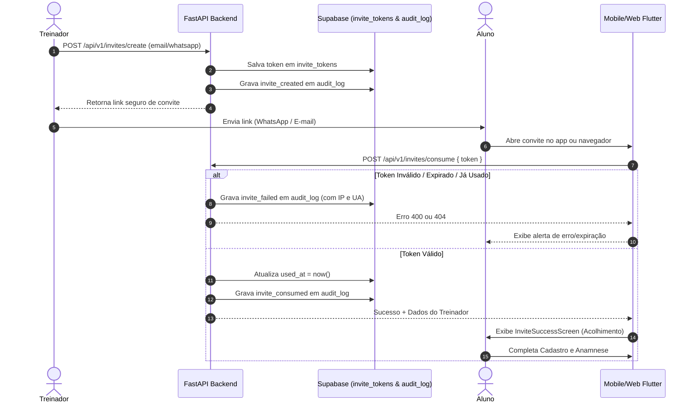

# Fluxo Seguro de Convites Intransferíveis & Auditoria (Mr. Coach)

Este documento descreve a arquitetura, modelo de segurança e fluxo operacional para geração, envio, consumo e auditoria de convites para alunos no Mr. Coach.

---

## 🔒 Princípios de Segurança

1. **Tokens Criptográficos de Alta Entropia:** Tokens gerados via `secrets.token_urlsafe(32)` com 256 bits de aleatoriedade.
2. **Intransferibilidade:** Cada convite é vinculado obrigatoriamente a um destinatário (`target_email` ou `target_phone`).
3. **Uso Único:** Uma vez consumido, o registro é atualizado com `used_at = now()` e novas tentativas são bloqueadas (`400 Bad Request`).
4. **Expiração Automática:** Validade máxima de 24 horas (`expires_at`).
5. **Auditoria Imutável:** Todas as tentativas (criação, envio, sucesso e falhas de abuso) são gravadas em `public.audit_log` via `service_role`.

---

## 🗺️ Diagrama Mermaid do Fluxo

---

## 🗄️ Tabelas Envolvidas

- `public.invite_tokens`: Guarda os convites ativos, validade e estado de consumo. Protegida por Row Level Security (RLS).
- `public.audit_log`: Tabela imutável de compliance para registro forense de todas as transações de convites.

